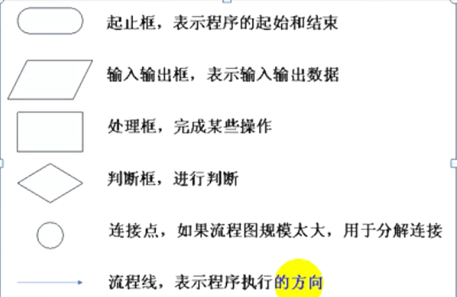
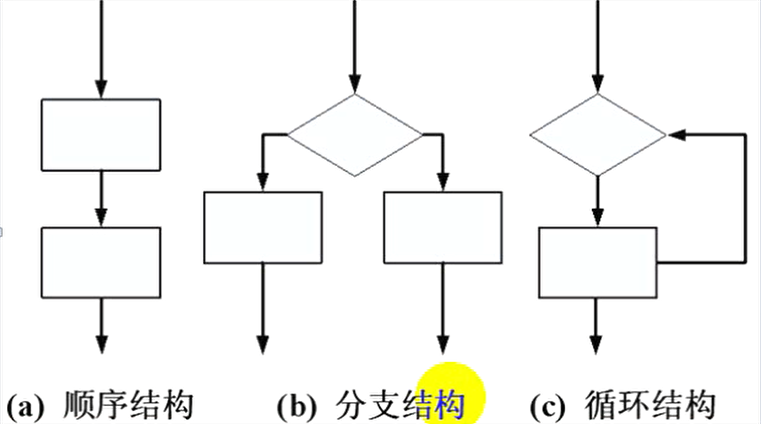

# 分支与循环

## 程序结构化

结构化程序设计思想是：把一个需要解决复杂问题分解为若干个模块来处理，每个模块解决一个小问题，这种分而治之的方法大大降低了程序设计的难度，结构化程序设计的核心问题是算法和控制结构；

代码详见：ProgramStructure

## 算法描述

算法指的是解决问题时的一系列方法和步骤；

**任何复杂的算法都可以拆分为三种控制结构**

## 顺序结构

C语言执行书讯执行结构，代码参见：Order

## if单分支

代码参考：SingleBranch

## 双分支

代码参考：DoubleBranch

## do...while

do...while结构一定会执行一次；
